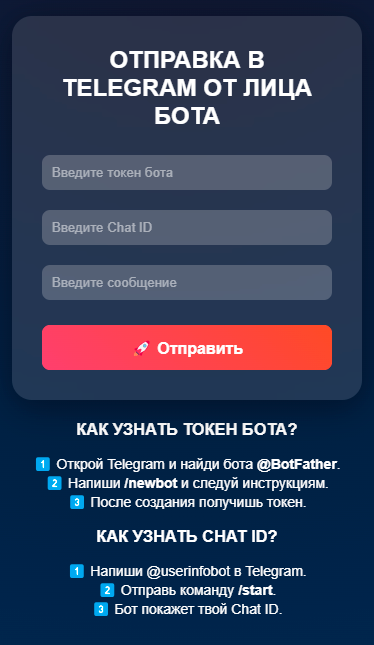

# [🚀 TeleSendBot](https://artur458.github.io/SendXBot/)

**TeleSendBot** – это веб-приложение для отправки сообщений в Telegram от имени бота. Просто введите токен, Chat ID и сообщение – и оно мгновенно отправится!

## 🎨 Особенности
✅ Современный и плавный дизайн с анимациями  
✅ Поддержка API Telegram для отправки сообщений  
✅ Интуитивно понятный интерфейс  
✅ Встроенный туториал по получению токена и Chat ID  

## 📸 Скриншоты


## 🔧 Как использовать?
1️⃣ Получите **токен бота** у [@BotFather](https://t.me/BotFather):  
   - Откройте Telegram и найдите [@BotFather](https://t.me/BotFather)  
   - Напишите команду `/newbot` и следуйте инструкциям  
   - После создания бота получите его токен  

2️⃣ Узнайте **Chat ID** с помощью [@userinfobot](https://t.me/userinfobot):  
   - Найдите [@userinfobot](https://t.me/userinfobot) в Telegram  
   - Напишите `/start`, и бот пришлёт ваш Chat ID  

3️⃣ Заполните форму на сайте и нажмите «Отправить» 🚀

## 📥 Установка (локально)
Если хотите запустить сайт у себя:
```sh
git clone https://github.com/artur458/TeleSendBot.git
cd TeleSendBot
open index.html
```

## 📌 TODO
- [ ] Добавить поддержку отправки файлов
- [ ] Сделать возможность сохранения токена и Chat ID
- [ ] Улучшить валидацию форм

## 🤝 Контакты
Если есть вопросы или предложения – пишите в Telegram: [@artur1591](https://t.me/artur1591)  

⭐ **Если проект понравился – поставьте звезду на GitHub!**

